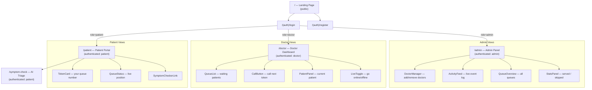
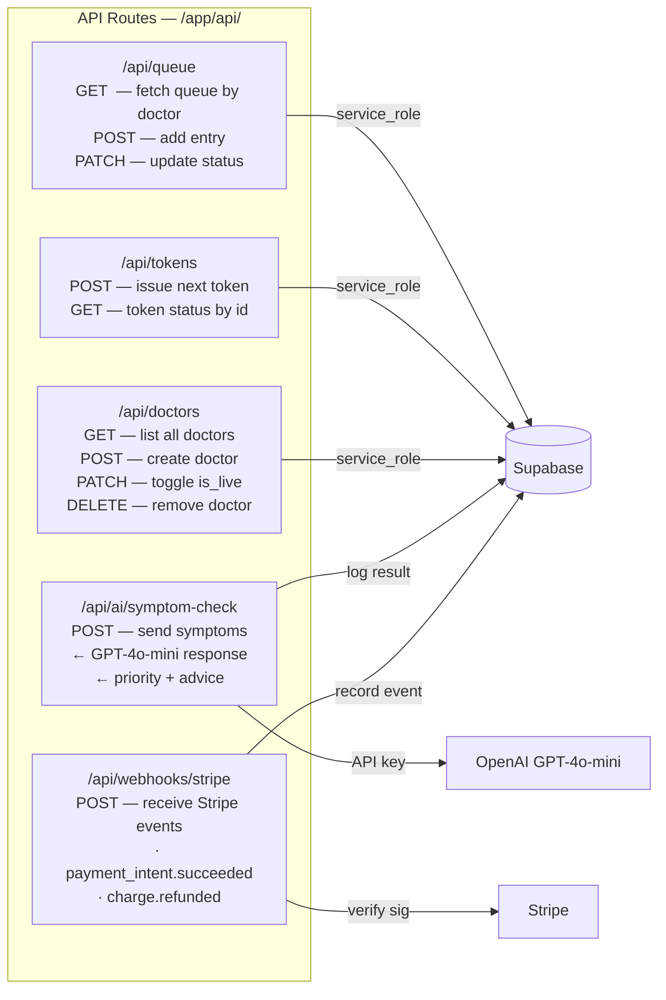
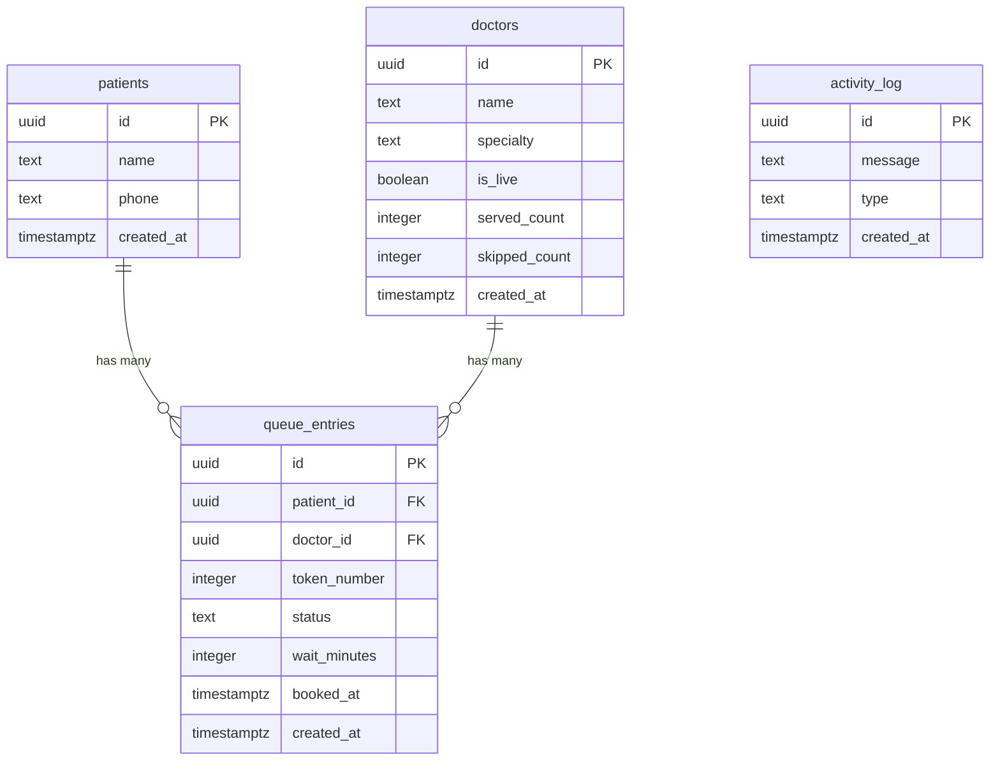
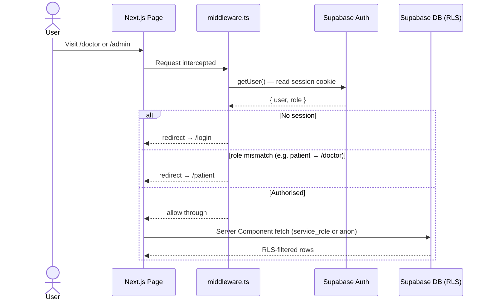
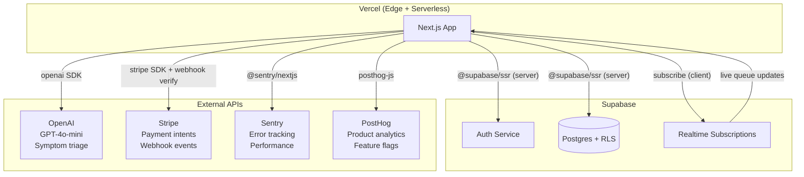

# MediQueue v2 — Architecture

> Generated: 2026-06-21  
> Stack: Next.js 14 App Router · Supabase · Stripe · OpenAI · Vercel

---

## 1. System Overview

```
┌─────────────────────────────────────────────────────────────────────────────┐
│                              VERCEL EDGE NETWORK                            │
│                                                                             │
│  ┌──────────────────────────────────────────────────────────────────────┐  │
│  │                     NEXT.JS 14 APP ROUTER                            │  │
│  │                                                                      │  │
│  │   PAGES (Server Components)         API ROUTES (Route Handlers)      │  │
│  │   ─────────────────────────         ────────────────────────────     │  │
│  │   /                (landing)        /api/queue          (CRUD)       │  │
│  │   /patient         (token UI)       /api/tokens         (issue)      │  │
│  │   /doctor          (dashboard)      /api/doctors        (CRUD)       │  │
│  │   /admin           (panel)          /api/ai/symptom-check (OpenAI)   │  │
│  │   /symptom-check   (AI triage)      /api/webhooks/stripe  (events)   │  │
│  │   /(auth)/login                                                      │  │
│  │   /(auth)/register                                                   │  │
│  │                                                                      │  │
│  └──────────────────────────────────────────────────────────────────────┘  │
│                │                                    │                       │
│         middleware.ts                        service role key               │
│       (auth + RBAC guard)                   (server-side only)             │
└────────────────┼────────────────────────────────────┼───────────────────────┘
                 │                                    │
       ┌─────────▼──────────┐             ┌──────────▼──────────┐
       │   SUPABASE AUTH    │             │  SUPABASE POSTGRES  │
       │                    │             │                     │
       │  Roles:            │             │  patients           │
       │  · patient         │◄────────────│  doctors            │
       │  · doctor          │  RLS checks │  queue_entries      │
       │  · admin           │             │  activity_log       │
       └────────────────────┘             └─────────────────────┘
                                                    │
                    ┌───────────────────────────────┼──────────────────────┐
                    │                               │                      │
          ┌─────────▼──────┐             ┌──────────▼──────┐   ┌──────────▼──────┐
          │    OPENAI      │             │     STRIPE      │   │  SENTRY/POSTHOG │
          │  GPT-4o-mini   │             │                 │   │                 │
          │  Symptom triage│             │  Payments       │   │  Errors/Events  │
          └────────────────┘             └─────────────────┘   └─────────────────┘
```

---

## 2. Frontend Pages & Components



---

## 3. API Routes



---

## 4. Database Schema & Relationships



### Status State Machine — `queue_entries.status`

```
                    ┌─────────┐
              ┌────►│ waiting │◄──────────────────┐
              │     └────┬────┘                   │
              │          │ doctor calls token      │
              │     ┌────▼────┐                   │
              │     │ called  │                   │
              │     └────┬────┘                   │
              │          │ patient arrives         │
              │     ┌────▼────┐                   │
              │     │ serving │                   │
              │     └────┬────┘                   │
              │          │                        │
              │    ┌──────────────┐               │
              │    │              │               │
              │  ┌─▼──┐       ┌───▼────┐          │
              │  │done│       │skipped │──────────┘
              │  └────┘       └────────┘  re-queued
              │
           ┌──▼─────────┐
           │ cancelled  │
           └────────────┘
```

---

## 5. Auth Flow & Role-Based Access



### Role Permission Matrix

```
┌────────────────────────┬─────────┬────────┬───────┐
│ Resource               │ patient │ doctor │ admin │
├────────────────────────┼─────────┼────────┼───────┤
│ /patient               │   ✅    │   ❌   │  ✅   │
│ /doctor                │   ❌    │   ✅   │  ✅   │
│ /admin                 │   ❌    │   ❌   │  ✅   │
│ /symptom-check         │   ✅    │   ❌   │  ✅   │
│ GET  /api/queue        │   ✅    │   ✅   │  ✅   │
│ POST /api/queue        │   ✅    │   ❌   │  ✅   │
│ PATCH /api/queue       │   ❌    │   ✅   │  ✅   │
│ GET  /api/doctors      │   ✅    │   ✅   │  ✅   │
│ POST /api/doctors      │   ❌    │   ❌   │  ✅   │
│ PATCH /api/doctors     │   ❌    │   ✅   │  ✅   │
│ DELETE /api/doctors    │   ❌    │   ❌   │  ✅   │
│ POST /api/tokens       │   ✅    │   ❌   │  ✅   │
│ POST /api/ai/symptom-check │ ✅  │   ❌   │  ✅   │
└────────────────────────┴─────────┴────────┴───────┘
```

---

## 6. External Service Integration



---

## 7. Data Flow — Patient Books a Token

```
Patient                  Next.js                 Supabase              OpenAI
  │                         │                       │                     │
  │── POST /api/tokens ────►│                       │                     │
  │   { doctorId, name,     │── INSERT patients ───►│                     │
  │     phone, symptoms }   │◄─ { patientId } ──────│                     │
  │                         │                       │                     │
  │                         │── next_token_number() ►│                    │
  │                         │◄─ tokenNumber ─────────│                    │
  │                         │                       │                     │
  │                         │── POST symptom-check ──────────────────────►│
  │                         │◄─ { priority, advice } ─────────────────────│
  │                         │                       │                     │
  │                         │── INSERT queue_entries►│                    │
  │                         │   { patientId,        │                     │
  │                         │     doctorId,         │                     │
  │                         │     tokenNumber,      │                     │
  │                         │     priority }        │                     │
  │                         │                       │                     │
  │                         │── INSERT activity_log ►│                    │
  │◄── { token, waitMins } ─│                       │                     │
```

---

## 8. Folder → Route Map

```
mediqueue-v2/
├── src/
│   ├── app/
│   │   ├── page.tsx                     →  /
│   │   ├── layout.tsx                   →  root layout + providers
│   │   ├── (auth)/
│   │   │   ├── login/page.tsx           →  /login
│   │   │   └── register/page.tsx        →  /register
│   │   ├── (patient)/
│   │   │   ├── patient/page.tsx         →  /patient
│   │   │   └── symptom-check/page.tsx   →  /symptom-check
│   │   ├── (doctor)/
│   │   │   └── doctor/page.tsx          →  /doctor
│   │   ├── (admin)/
│   │   │   └── admin/page.tsx           →  /admin
│   │   └── api/
│   │       ├── queue/route.ts           →  /api/queue
│   │       ├── tokens/route.ts          →  /api/tokens
│   │       ├── doctors/route.ts         →  /api/doctors
│   │       ├── ai/
│   │       │   └── symptom-check/route.ts → /api/ai/symptom-check
│   │       └── webhooks/
│   │           └── stripe/route.ts      →  /api/webhooks/stripe
│   │
│   ├── components/
│   │   ├── ui/          →  Button, Input, Card, Badge, Spinner
│   │   ├── queue/       →  TokenCard, QueueList, StatusBadge
│   │   ├── doctor/      →  PatientPanel, CallButton, LiveToggle
│   │   └── layout/      →  Navbar, Sidebar, Footer
│   │
│   ├── lib/
│   │   ├── supabase/
│   │   │   ├── client.ts   →  createBrowserClient()
│   │   │   └── server.ts   →  createServerClient()
│   │   ├── stripe.ts       →  Stripe instance + helpers
│   │   ├── openai.ts       →  OpenAI instance
│   │   ├── sentry.ts       →  Sentry init
│   │   ├── posthog.ts      →  PostHog init
│   │   └── utils.ts        →  shared helpers
│   │
│   ├── types/
│   │   ├── database.ts     →  Supabase generated types
│   │   └── index.ts        →  shared app types
│   │
│   ├── hooks/
│   │   ├── useQueue.ts     →  realtime queue subscription
│   │   └── useUser.ts      →  current auth user + role
│   │
│   └── middleware.ts       →  auth guard + RBAC routing
│
├── supabase/
│   ├── config.toml
│   └── migrations/
│       └── 20260621141003_initial_schema.sql
│
└── docs/
    └── architecture.md     ←  this file
```
